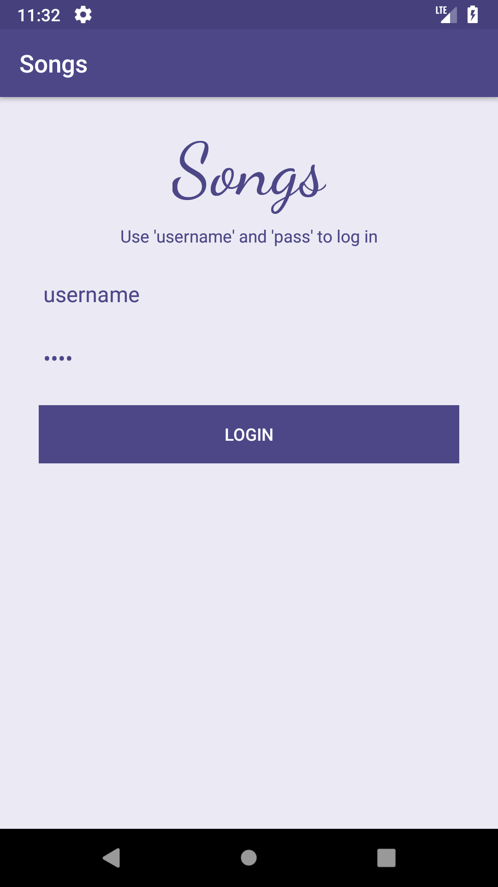
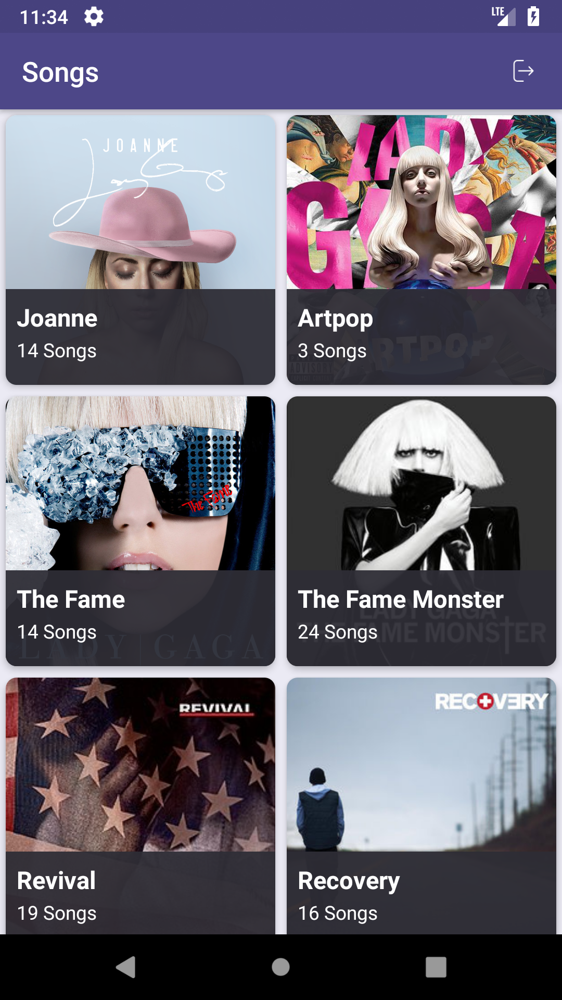

# Songs_CleanArchitecture

## This project demonstrates the Clean Architecture with RxJava/RxAndroid

    

## Features
:white_check_mark: Kotlin  
:white_check_mark: Clean architecture  
:white_check_mark: Test covered with `JUnit` and `Kotlin Mockito`. (domain and data layers)  
:white_check_mark: Observer Pattern  
:white_check_mark: Retrofit  

## TODO list:
:white_large_square: Test presentation layer  

| Login     | Songs   | 
| :-------------: | :-------------: | 
|  |  |
